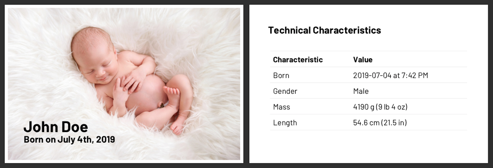

## `sndsgd/little-being-pdf`

A tool to create a PDF to announce the arrival of a little being. The idea for this was shamelessly ripped from my brother Francis Barnhart, who started doing this years ago.

## Setup

1. Install [Docker](https://docs.docker.com/install/)
1. Clone this repo
1. Run `make build`

## Usage

1. Create a copy of the `example` directory
1. Replace the image with your own
1. Update the contents of the `info.yaml` file as you see fit
1. Run `make pdf WHOMST=example`, replacing `example` with your directory
1. Open the PDF created in your directory

#### Partial Specification for `info.yaml`

| key | type | description |
| --- | ---- | ----------- |
| title | string | The title of the generated PDF |
| height | number | The page height of the generated PDF in inches* |
| width | number | The page width of the generated PDF in inches* |
| fontUrl | string | A url to include for loading a custom font |
| css | string | Any custom CSS styles to include before rendering |
| pages | Page[] | A list of pages |

_* `wkhtmltopdf` doesn't appear to be able to handle page sizes in mm without artifacts that affect full bleed images_

#### TODO

1. Improve validation error messages for `info.yaml`
1. Add page type documentation
1. Improve how CSS is used
1. Have time to make these updates 😅
